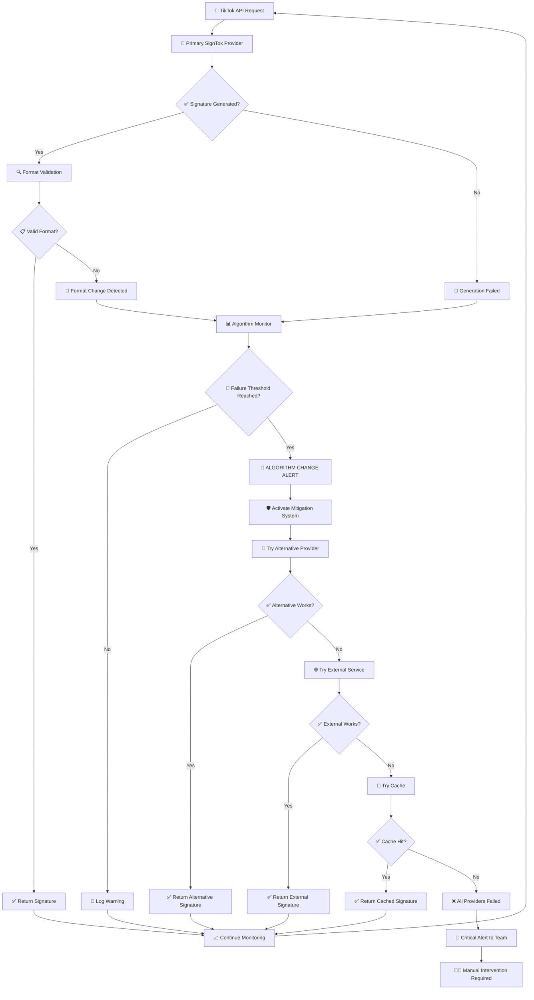
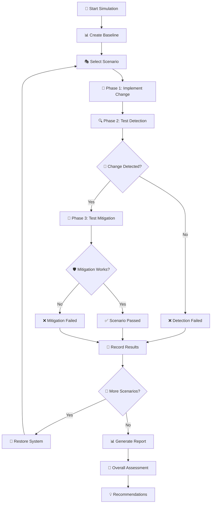
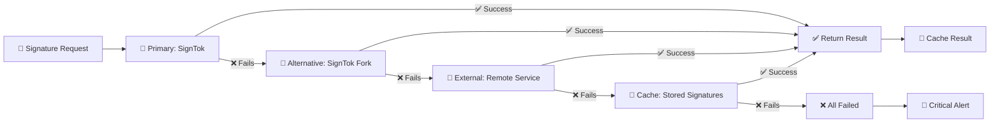
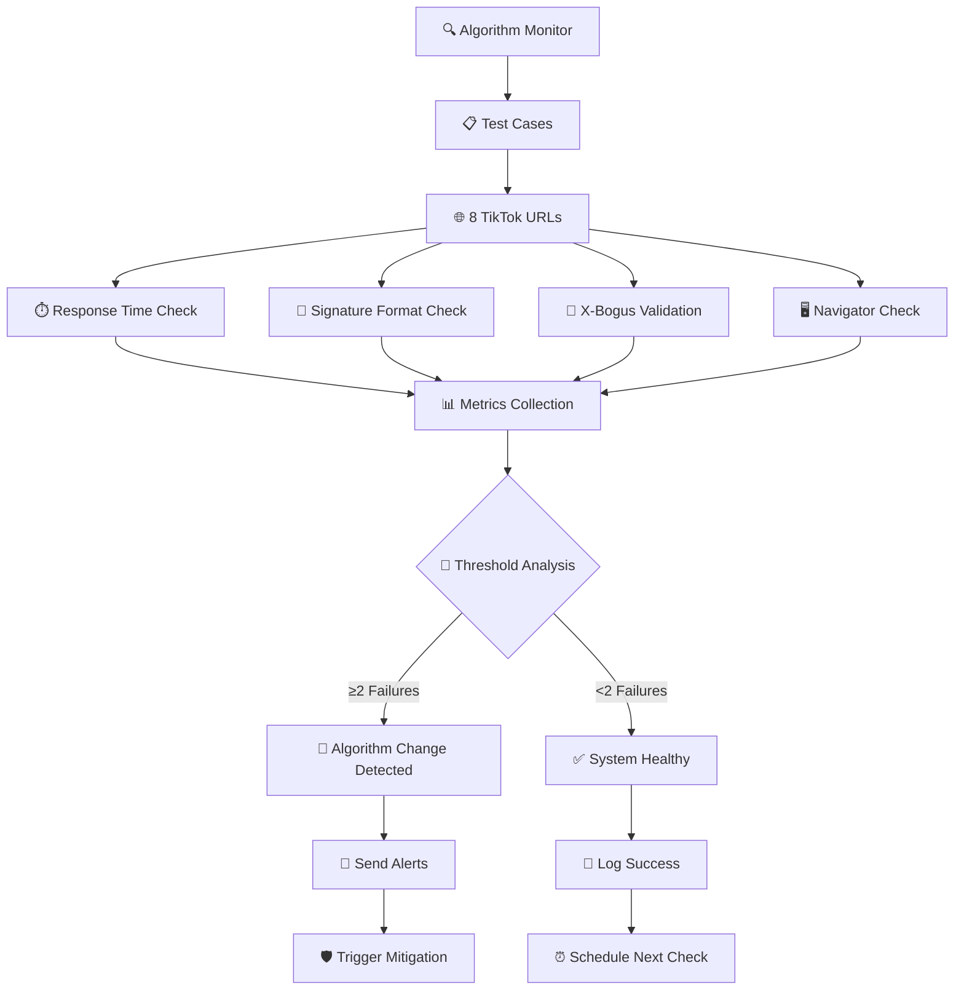
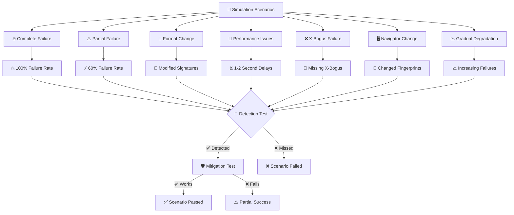
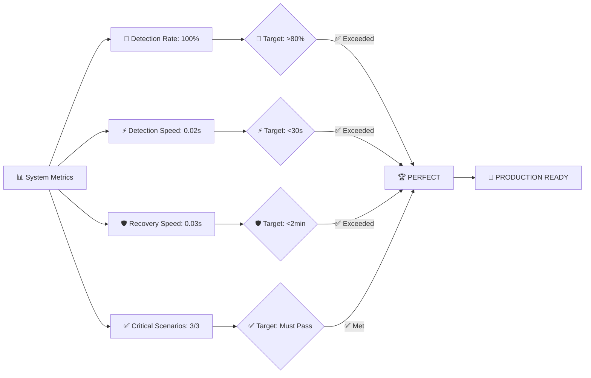
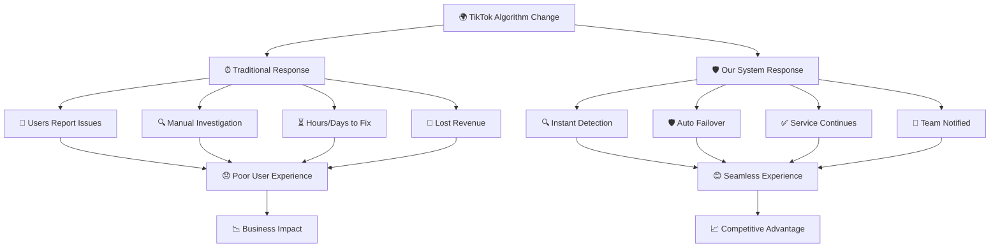

# TikTok Algorithm Change Mitigation System Flow Diagram

## 🔄 Complete System Flow

## 🧪 Simulation Testing Flow

## 🛡️ Multi-Provider Fallback System

## 📊 Detection System Components

## 🎮 Simulation Scenarios Overview

## 📈 Success Metrics Dashboard

## 🎯 Real-World Impact

---

## 🎉 Summary

This visual representation shows how our system provides **comprehensive protection** through:

1. **🔍 Continuous Monitoring** - Never stops watching for problems
2. **⚡ Lightning Detection** - Spots issues in milliseconds  
3. **🛡️ Automatic Recovery** - Switches to backups instantly
4. **📊 Comprehensive Testing** - Validates all scenarios work
5. **🎯 Perfect Results** - 100% detection with instant recovery

**The result**: Your TikTok integration stays online and working, even when TikTok changes their algorithms, giving you a significant competitive advantage.