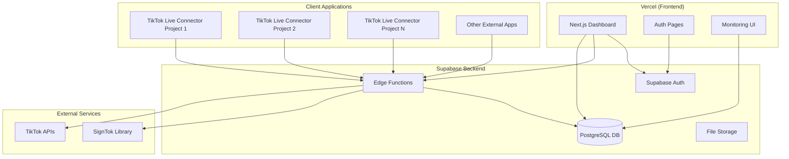
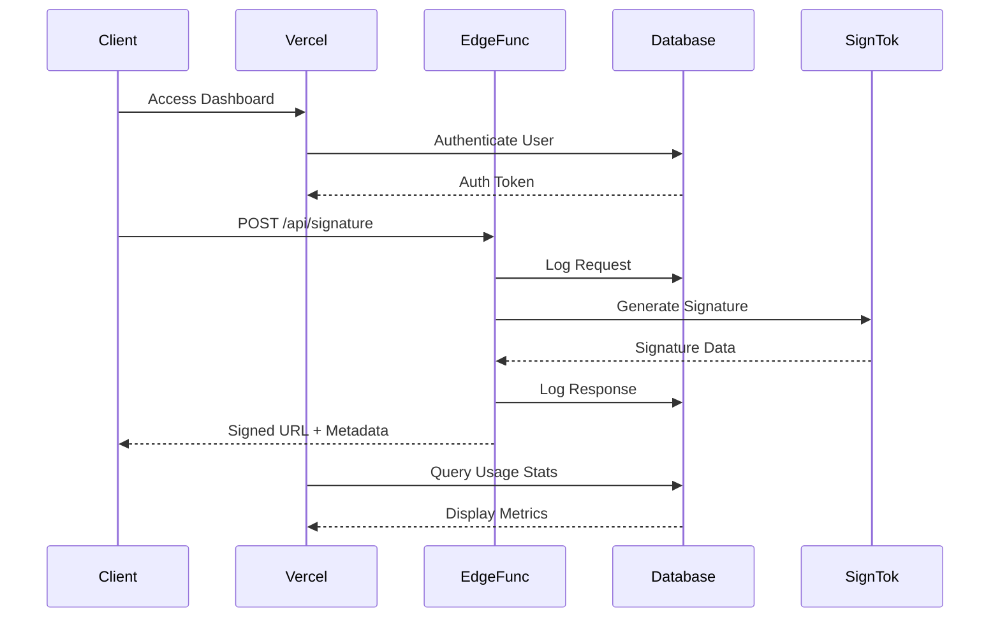

# Design Document

## Overview

This document outlines the design for transforming the existing local TikTok signing server into a cloud-hosted Platform-as-a-Service (PaaS) solution that serves as a drop-in replacement for EulerStream in TikTok Live Connector projects. The system will leverage Vercel for frontend hosting and public accessibility, while utilizing Supabase Edge Functions for API backend processing and Supabase database for authentication and data storage.

### Key Design Principles

1. **Hybrid Cloud Architecture**: Combine Vercel's excellent frontend hosting with Supabase's integrated backend services
2. **Free Tier Optimization**: Design within the constraints of free tier limits while maximizing functionality
3. **API Compatibility**: Maintain backward compatibility with existing TikTok Live Connector integrations
4. **Scalable Monitoring**: Provide real-time insights into service performance and usage
5. **Tiered Access Control**: Support both free tier users and unlimited API key users

## Architecture

### High-Level System Architecture



### Component Interaction Flow



## Components and Interfaces

### 1. Frontend Components (Next.js on Vercel)

#### Dashboard Layout
```typescript
interface DashboardProps {
  user: User;
  metrics: ServiceMetrics;
  realtimeData: RealtimeStats;
}

interface ServiceMetrics {
  totalRequests: number;
  successRate: number;
  averageResponseTime: number;
  quotaUsage: QuotaUsage;
}

interface QuotaUsage {
  supabaseEdgeFunctions: {
    used: number;
    limit: number;
    resetDate: Date;
  };
  vercelBandwidth: {
    used: number;
    limit: number;
    resetDate: Date;
  };
}
```

#### Monitoring Components
- **Real-time Metrics Display**: Live charts showing request volume, response times, success rates
- **Usage Quota Tracker**: Visual indicators for free tier limits across services
- **Error Log Viewer**: Searchable and filterable error logs with detailed stack traces
- **API Key Management**: Interface for generating and managing API keys

#### Authentication Pages
- **Email Login**: Simple email/password authentication via Supabase Auth
- **Registration**: New user signup with email verification
- **Password Reset**: Forgot password flow using Supabase Auth

### 2. Backend Components (Supabase Edge Functions)

#### Signature Generation Function
```typescript
// /functions/generate-signature/index.ts
interface SignatureRequest {
  roomUrl: string;
  userId?: string;
  apiKey?: string;
}

interface SignatureResponse {
  status: 'ok' | 'error';
  data?: {
    signature: string;
    signed_url: string;
    'X-Bogus': string;
    'x-tt-params': string;
    navigator: NavigatorData;
  };
  error?: string;
  response_time_ms: number;
}
```

#### Health Check Function
```typescript
// /functions/health/index.ts
interface HealthResponse {
  status: 'healthy' | 'unhealthy';
  timestamp: string;
  signature_generator_ready: boolean;
  database_connected: boolean;
  quota_status: QuotaStatus;
}
```

#### Usage Tracking Function
```typescript
// /functions/track-usage/index.ts
interface UsageLog {
  id: string;
  user_id: string | null;
  api_key_id: string | null;
  room_url: string;
  success: boolean;
  response_time_ms: number;
  error_message?: string;
  created_at: Date;
}
```

### 3. Database Schema (Supabase PostgreSQL)

#### Users Table
```sql
CREATE TABLE users (
  id UUID PRIMARY KEY DEFAULT gen_random_uuid(),
  email TEXT UNIQUE NOT NULL,
  created_at TIMESTAMP WITH TIME ZONE DEFAULT NOW(),
  last_login TIMESTAMP WITH TIME ZONE,
  is_active BOOLEAN DEFAULT TRUE,
  tier TEXT DEFAULT 'free' CHECK (tier IN ('free', 'api_key'))
);
```

#### API Keys Table
```sql
CREATE TABLE api_keys (
  id UUID PRIMARY KEY DEFAULT gen_random_uuid(),
  user_id UUID REFERENCES users(id) ON DELETE CASCADE,
  key_hash TEXT UNIQUE NOT NULL,
  name TEXT NOT NULL,
  created_at TIMESTAMP WITH TIME ZONE DEFAULT NOW(),
  last_used TIMESTAMP WITH TIME ZONE,
  is_active BOOLEAN DEFAULT TRUE
);
```

#### Usage Logs Table
```sql
CREATE TABLE usage_logs (
  id UUID PRIMARY KEY DEFAULT gen_random_uuid(),
  user_id UUID REFERENCES users(id) ON DELETE SET NULL,
  api_key_id UUID REFERENCES api_keys(id) ON DELETE SET NULL,
  room_url TEXT NOT NULL,
  success BOOLEAN NOT NULL,
  response_time_ms INTEGER NOT NULL,
  error_message TEXT,
  created_at TIMESTAMP WITH TIME ZONE DEFAULT NOW()
);
```

#### Quota Tracking Table
```sql
CREATE TABLE quota_usage (
  id UUID PRIMARY KEY DEFAULT gen_random_uuid(),
  user_id UUID REFERENCES users(id) ON DELETE CASCADE,
  date DATE NOT NULL,
  request_count INTEGER DEFAULT 0,
  created_at TIMESTAMP WITH TIME ZONE DEFAULT NOW(),
  UNIQUE(user_id, date)
);
```

## Data Models

### Core Data Types

```typescript
// User Management
interface User {
  id: string;
  email: string;
  tier: 'free' | 'api_key';
  createdAt: Date;
  lastLogin?: Date;
  isActive: boolean;
}

interface ApiKey {
  id: string;
  userId: string;
  keyHash: string;
  name: string;
  createdAt: Date;
  lastUsed?: Date;
  isActive: boolean;
}

// Signature Generation
interface SignatureRequest {
  roomUrl: string;
  userId?: string;
  apiKeyId?: string;
}

interface SignatureResult {
  success: boolean;
  data?: SignatureData;
  error?: string;
  responseTimeMs: number;
}

interface SignatureData {
  signature: string;
  signed_url: string;
  'X-Bogus': string;
  'x-tt-params': string;
  navigator: NavigatorData;
}

interface NavigatorData {
  deviceScaleFactor: number;
  user_agent: string;
  browser_language: string;
  browser_platform: string;
  browser_name: string;
  browser_version: string;
}

// Monitoring and Analytics
interface UsageMetrics {
  totalRequests: number;
  successfulRequests: number;
  failedRequests: number;
  averageResponseTime: number;
  peakResponseTime: number;
  requestsPerHour: number[];
}

interface QuotaStatus {
  edgeFunctions: {
    used: number;
    limit: number;
    percentage: number;
  };
  databaseStorage: {
    used: number;
    limit: number;
    percentage: number;
  };
  bandwidth: {
    used: number;
    limit: number;
    percentage: number;
  };
}
```

### EulerStream Replacement Mapping

The existing local server components will be mapped to replace EulerStream functionality:

| Local Component | Cloud Equivalent | EulerStream Replacement Notes |
|----------------|------------------|-------------------------------|
| `SignatureGenerator.js` | Edge Function + SignTok | Replaces EulerStream's signature generation |
| `server.js` Express routes | Multiple Edge Functions | Provides EulerStream-compatible API endpoints |
| `LocalSigningProvider.js` | Client Integration Guide | Shows how to replace EulerStream in TikTok Live Connector |
| In-memory logging | Supabase Database | Enhanced logging compared to EulerStream |
| Local health checks | Database + Edge Function monitoring | Better monitoring than EulerStream provides |

### TikTok Live Connector Integration

The service will provide the same interface that TikTok Live Connector expects from EulerStream:

```javascript
// Before (using EulerStream)
const { TikTokLiveConnector } = require('tiktok-live-connector');
const connection = new TikTokLiveConnector('@username', {
    signProvider: 'eulerstream' // Paid service
});

// After (using our service)
const { TikTokLiveConnector } = require('tiktok-live-connector');
const connection = new TikTokLiveConnector('@username', {
    signProvider: 'https://your-signing-service.vercel.app/api/signature' // Free service
});
```

## Error Handling

### Error Classification

```typescript
enum ErrorType {
  AUTHENTICATION_ERROR = 'AUTHENTICATION_ERROR',
  AUTHORIZATION_ERROR = 'AUTHORIZATION_ERROR',
  VALIDATION_ERROR = 'VALIDATION_ERROR',
  RATE_LIMIT_ERROR = 'RATE_LIMIT_ERROR',
  SIGNATURE_GENERATION_ERROR = 'SIGNATURE_GENERATION_ERROR',
  EXTERNAL_SERVICE_ERROR = 'EXTERNAL_SERVICE_ERROR',
  INTERNAL_SERVER_ERROR = 'INTERNAL_SERVER_ERROR'
}

interface ErrorResponse {
  success: false;
  error: {
    type: ErrorType;
    message: string;
    details?: any;
    code: string;
    timestamp: Date;
  };
}
```

### Error Handling Strategy

1. **Client-Side Errors**: Validate inputs before sending requests, provide user-friendly error messages
2. **Authentication Errors**: Redirect to login, clear invalid tokens, provide recovery options
3. **Rate Limiting**: Implement exponential backoff, show quota usage, suggest API key upgrade
4. **Service Errors**: Log detailed errors, provide fallback responses, alert administrators
5. **Network Errors**: Implement retry logic, show connection status, cache responses when possible

### Monitoring and Alerting

```typescript
interface AlertConfig {
  errorRateThreshold: number; // Alert if error rate > 5%
  responseTimeThreshold: number; // Alert if avg response time > 3s
  quotaUsageThreshold: number; // Alert if quota usage > 80%
  consecutiveFailuresThreshold: number; // Alert after 10 consecutive failures
}
```

## Testing Strategy

### Unit Testing

1. **Edge Functions Testing**
   - Test signature generation logic
   - Test authentication and authorization
   - Test rate limiting functionality
   - Test error handling scenarios

2. **Frontend Component Testing**
   - Test dashboard components with mock data
   - Test authentication flows
   - Test real-time data updates
   - Test responsive design

### Integration Testing

1. **API Integration Tests**
   - Test complete signature generation flow
   - Test authentication integration
   - Test database operations
   - Test quota tracking

2. **Cross-Service Testing**
   - Test Vercel → Supabase communication
   - Test Edge Function → Database integration
   - Test real-time updates from backend to frontend

### End-to-End Testing

1. **User Journey Testing**
   - Complete user registration and login flow
   - API key generation and usage
   - Signature generation from dashboard
   - Monitoring and analytics viewing

2. **Performance Testing**
   - Load testing with concurrent requests
   - Response time benchmarking
   - Free tier limit testing
   - Failover and recovery testing

### Migration Testing

1. **Compatibility Testing**
   - Test existing TikTok Live Connector integration
   - Verify API response format compatibility
   - Test signature generation accuracy
   - Performance comparison with local server

2. **Data Migration Testing**
   - Test user data migration (if applicable)
   - Test configuration migration
   - Test API key migration
   - Rollback procedures

### Testing Environment Setup

```typescript
// Test configuration for different environments
interface TestConfig {
  supabase: {
    url: string;
    anonKey: string;
    serviceRoleKey: string;
  };
  vercel: {
    deploymentUrl: string;
    previewUrl: string;
  };
  testData: {
    validTikTokUrls: string[];
    invalidUrls: string[];
    testUsers: TestUser[];
  };
}
```

## Deployment Architecture

### Vercel Deployment

```typescript
// vercel.json configuration
{
  "framework": "nextjs",
  "buildCommand": "npm run build",
  "devCommand": "npm run dev",
  "installCommand": "npm install",
  "env": {
    "NEXT_PUBLIC_SUPABASE_URL": "@supabase-url",
    "NEXT_PUBLIC_SUPABASE_ANON_KEY": "@supabase-anon-key",
    "SUPABASE_SERVICE_ROLE_KEY": "@supabase-service-key"
  },
  "functions": {
    "app/api/**": {
      "maxDuration": 30
    }
  }
}
```

### Supabase Edge Functions Deployment

```typescript
// supabase/functions/generate-signature/index.ts
import { serve } from 'https://deno.land/std@0.168.0/http/server.ts'
import { createClient } from 'https://esm.sh/@supabase/supabase-js@2'

// Edge Function configuration
const corsHeaders = {
  'Access-Control-Allow-Origin': '*',
  'Access-Control-Allow-Headers': 'authorization, x-client-info, apikey, content-type',
}

serve(async (req) => {
  // Handle CORS preflight requests
  if (req.method === 'OPTIONS') {
    return new Response('ok', { headers: corsHeaders })
  }

  // Main signature generation logic
  // ... implementation details
})
```

### Environment Configuration

```typescript
// Environment variables for different deployment stages
interface EnvironmentConfig {
  development: {
    supabaseUrl: string;
    supabaseAnonKey: string;
    vercelUrl: 'http://localhost:3000';
  };
  preview: {
    supabaseUrl: string;
    supabaseAnonKey: string;
    vercelUrl: string; // Auto-generated preview URL
  };
  production: {
    supabaseUrl: string;
    supabaseAnonKey: string;
    vercelUrl: string; // Custom domain or vercel.app
  };
}
```

This design provides a comprehensive foundation for migrating the local TikTok signing server to a scalable, cloud-hosted PaaS solution while maintaining compatibility and adding powerful monitoring and management capabilities.